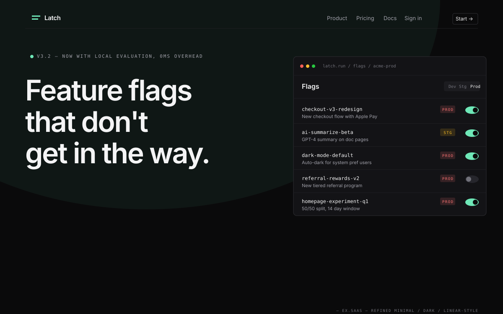
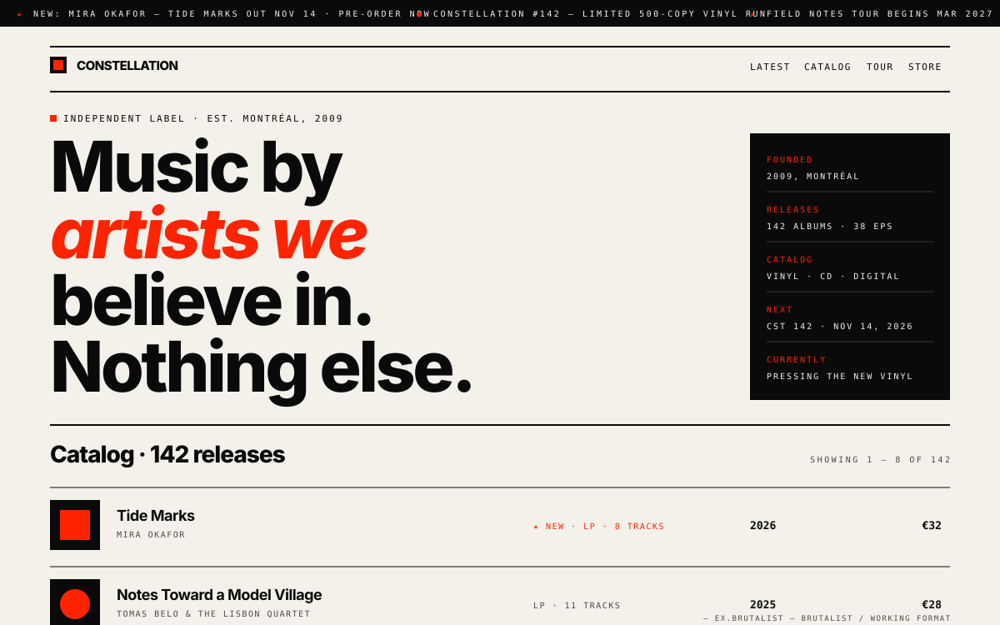
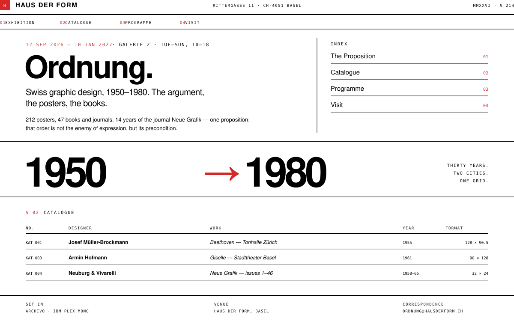

# Frontend Design Skill

> Модульный скилл для ИИ-агентов, создающих веб-сайты и интерфейсы. Результат, который читается как работа старшего дизайнера — не как вывод LLM.

[](LICENSE)
[](#-что-внутри)
[](#-что-внутри)
[](#-что-внутри)
[](CONTRIBUTING.md)
[](anti-patterns.md)

**7 842 строки. 18 файлов. Ноль фиолетово-синих градиентов.**

[English version →](README.en.md)

---

## 📖 Содержание

- [Проблема](#-проблема)
- [Решение](#-решение)
- [Скриншоты примеров](#-скриншоты-примеров)
- [Что внутри](#-что-внутри)
- [Быстрый старт](#-быстрый-старт)
- [Гайд по использованию](#-гайд-по-использованию)
- [Стратегии загрузки](#-стратегии-загрузки)
- [Качество кода](#-качество-кода)
- [Кто это использует](#-кто-это-использует)
- [Contributing](#-contributing)
- [Лицензия](#-лицензия)

---

## 🎯 Проблема

Попросите любого ИИ-агента сделать лендинг. Вы получите:

- 🔮 Hero-секцию с фиолетово-синим градиентом
- 🎯 Центрированный заголовок, две CTA-кнопки, лого-бар «Trusted by 10,000+»
- 📦 Три одинаковые карточки фич в ряд, повторённые три раза
- 🎠 Карусель отзывов со стоковыми фотографиями
- 💬 Lorem-ipsum-уровень копирайтинга, который ничего не говорит

Это **AI slop** — визуальный маркер «это сгенерировано LLM». Это то, что выдаёт каждый ИИ по умолчанию, потому что это то, что каждый ИИ видел десять тысяч раз в обучающих данных. Это гравитационный центр генеративного вывода, и всё должно активно с ним бороться.

**Скиллы в этом репозитории борются с ним.**

---

## ✨ Решение

```
7 842 строки · 18 файлов · 22 подстиля · 0 фиолетово-синих градиентов
```

| Файл | Строк | Что внутри |
|---|---:|---|
| **[SKILL.md](SKILL.md)** | 212 | Ядро: принципы, процесс, идентичность. Agent Skills frontmatter |
| **[aesthetics.md](aesthetics.md)** | 320 | 7 высокоуровневых эстетик |
| **[minimal-ui-patterns.md](minimal-ui-patterns.md)** | 924 | 11 подстилей SaaS (Linear, Stripe, Vercel, ...) |
| **[editorial-patterns.md](editorial-patterns.md)** | 476 | 6 editorial подстилей (Pentagram, NYT Mag, ...) |
| **[brutalist-patterns.md](brutalist-patterns.md)** | 437 | 5 brutalist подстилей (Bandcamp, Working Format, ...) |
| **[product-ui-patterns.md](product-ui-patterns.md)** | 1434 | 10 компонентов Linear-style с кодом |
| **[typography.md](typography.md)** | 351 | Шрифты, шкала, пары, анти-паттерны |
| **[color.md](color.md)** | 303 | Токены, палитры, контраст, dark mode |
| **[layout.md](layout.md)** | 295 | Контейнеры, spacing-шкала, сетки, адаптивность |
| **[anti-patterns.md](anti-patterns.md)** | 376 | 28 AI-slop паттернов с до/после |
| **[components.md](components.md)** | 420 | Кнопки, формы, карточки, состояния |
| **[motion.md](motion.md)** | 293 | Анимация, easing, accessibility |
| **[content.md](content.md)** | 272 | Заголовки, копирайтинг, микрокопи |
| **[accessibility.md](accessibility.md)** | 269 | Семантика, клавиатура, фокус, ARIA, тест-протокол |
| **[performance.md](performance.md)** | 210 | Бюджеты, шрифты, картинки, Core Web Vitals |
| **[imagery.md](imagery.md)** | 226 | CSS/SVG-композиции, фото-арт-дирекшн, иконки, favicon/og |
| **[code-style.md](code-style.md)** | 850 | Качество кода, без GPT-slop, комментарии |
| **[checklist.md](checklist.md)** | 174 | Pre-ship QA |

---

## 📸 Скриншоты примеров

Шесть сайтов, построенных с применением этих скиллов — от тёплой типографики до холодного dark SaaS, швейцарской сетки и сырого брутализма.

### Демонстрационные превью (стилевые композиции)

Два первых — дизайн-композиции, демонстрирующие стили:

#### Пример 1: Дизайн-студия *Halftone* (Editorial / Warm / Light)

Создано с применением `aesthetics.md` §2 (Editorial) + `editorial-patterns.md` (Pentagram archive).

**Что применено из скиллов:**
- Warm paper `#FAF6F0` + ink `#1A1714` + editorial red `#C8281C` (`color.md`)
- Fraunces display + Inter text + JetBrains Mono kickers (`typography.md`)
- Асимметричный hero, не centered-everything (`anti-patterns.md` §6)
- Hero headline `clamp(3.5rem, 9vw, 8.5rem)` — массивный, не дефолтный (`typography.md`)
- 6 работ как magazine index, не «3-card grid» (`anti-patterns.md` §12)
- Конкретные имена: «Mira Almeida», «Q3 2026», «14,000 shelves» (`content.md`)
- Никаких emoji, никаких стоковых фото (`anti-patterns.md` §10)
- Footer с colophon — реальный editorial паттерн (`aesthetics.md` §2)


---

#### Пример 2: SaaS-продукт *Tempo* (Refined Minimal / Dark / Linear-style)

Создано с применением `minimal-ui-patterns.md` §1 (Linear).

**Что применено из скиллов:**
- Dark surface `#0A0A0A` + ink `#F5F5F5` + Linear purple `#7B85E6` (`color.md` §Dark Mode)
- **Не** pure black, **не** pure white — скилл явно запрещает (`color.md`)
- Accent purple слегка светлее в dark mode (`color.md`)
- Асимметричный hero: текст слева, dashboard справа (`anti-patterns.md` §6)
- Hero headline делает claim, не «Welcome to Tempo» (`content.md`)
- Dashboard mockup в CSS/SVG — без стоковых скриншотов (`anti-patterns.md` §10)
- Реальные метрики: P95 latency, конкретные commits с hash + impact (`content.md`)
- 3 фичи asymmetric: metrics / replay / install — три разных формата (`anti-patterns.md` §11/12)
- Pricing: 2 честных tier'а, не 3 с middle highlighted (`anti-patterns.md` §13)
- Footer с build info: `v2.4.7 · build a3f9c2 · uptime 99.98%` (`aesthetics.md` §6)


---

### Рабочие примеры (готовые single-file сайты)

Четыре полноценных сайта в папке [`examples/`](examples/). Каждый — single HTML файл с встроенным CSS и минимальным JS. Открывается в любом браузере без сборки.

| # | Скриншот | Файл | Стиль | Применённые скиллы |
|---|---|---|---|---|
| 1 |  | [`example-magazine.html`](examples/example-magazine.html) | **Editorial** (NYT Magazine) | `editorial-patterns.md` + `typography.md` + `color.md` |
| 2 |  | [`example-saas.html`](examples/example-saas.html) | **Refined Minimal dark** (Linear) | `minimal-ui-patterns.md` + `product-ui-patterns.md` |
| 3 |  | [`example-brutalist.html`](examples/example-brutalist.html) | **Brutalist** (Working Format) | `brutalist-patterns.md` + `typography.md` |
| 4 |  | [`example-swiss.html`](examples/example-swiss.html) | **Swiss** (Müller-Brockmann) | `aesthetics.md` §3 + `layout.md` + `accessibility.md` |

#### Пример 3: Литературный журнал *The Common Review* (Editorial)

Квартальный журнал эссе, критики и писем. Issue 14, Winter 2026, тема номера — «On Repair».

**Что применено из скиллов:**
- ✅ Source Serif 4 throughout (display + body — одна семья) (`typography.md`)
- ✅ JetBrains Mono для metadata (issue numbers, page numbers, dates) (`typography.md`)
- ✅ **B/W minimal** + editorial red `#C8281C` accent (`color.md`)
- ✅ Асимметричный hero с SVG cover-art «after Ruskin» (`anti-patterns.md` §10)
- ✅ **Drop cap** на lede параграфе — настоящий editorial паттерн (`editorial-patterns.md` §3)
- ✅ Pull quote с правилами сверху/снизу (`editorial-patterns.md` §3)
- ✅ Section markers (§01, §02, §03) с правилами (`editorial-patterns.md` §1)
- ✅ Real-feeling content: «Marta Bellucci spent three months with one of the youngest, who is sixty-three» (`content.md`)
- ✅ Colophon в footer (`editorial-patterns.md` §1)

---

#### Пример 4: Feature flag система *Latch* (SaaS / Linear-style)

Developer tool для product teams. Sub-стиль — Linear.

**Что применено из скиллов:**
- ✅ Dark surface `#0A0A0B` + ink `#F4F4F5` (НЕ pure black/white — `color.md` явно запрещает)
- ✅ Mint accent `#6EE7B7` — использован <10% пикселей (`color.md` §"How to Use the Accent")
- ✅ Hero asymmetric: текст слева, dashboard справа (`anti-patterns.md` §6)
- ✅ Hero headline: «Feature flags that don't get in the way.» — конкретный claim (`content.md`)
- ✅ **Dashboard mockup в CSS-only**: panel chrome, segmented control, flag rows с toggle (`product-ui-patterns.md` §1, §6)
- ✅ 3 фичи asymmetric: install (с code block) / targeting (с viz) / speed (с viz) (`anti-patterns.md` §11/12)
- ✅ Pricing: 2 честных tier'а (Hobby + Production) (`anti-patterns.md` §13)
- ✅ Footer с build info: `v3.2.7 · build 8f4a12 · uptime 99.99%` (`aesthetics.md` §6)
- ✅ Tabular numerals everywhere (font-variant-numeric) (`typography.md`)
- ✅ JavaScript: segmented control + interactive toggle (`components.md`)

---

#### Пример 5: Инди-лейбл *Constellation Records* (Brutalist)

Independent record label из Монреаля. Sub-стиль — Working Format + Bandcamp.

**Что применено из скиллов:**
- ✅ **Marquee** с announcements (60s loop, respects `prefers-reduced-motion`) (`motion.md`)
- ✅ Pure black `#0A0A0A` + warm cream `#F4F1EB` + electric red `#FF2400` (`brutalist-patterns.md` §2)
- ✅ **Sharp corners everywhere** (`border-radius: 0`) (`brutalist-patterns.md` §"Anti-patterns")
- ✅ Hero с massive display type, italic accent в красном (`brutalist-patterns.md` §"Hallmarks")
- ✅ Hero meta column в inverted color (ink background, surface text) (`brutalist-patterns.md` §2)
- ✅ Album covers как **CSS-only abstract compositions** (concentric circles, squares) (`anti-patterns.md` §10)
- ✅ Catalog: 8 релизов, hover shifts padding + title color (`components.md`)
- ✅ **Manifesto section** с большой typography, italic emphasis в accent (`editorial-patterns.md` §1 + brutalist merge)
- ✅ Tour dates с status indicators (`ON SALE` / `SOLD OUT`) (`components.md` §"Status indicators")
- ✅ Footer в inverted color, маркеры в accent color (`brutalist-patterns.md` §2)

---

#### Пример 6: Выставка *Ordnung* в Haus der Form (Swiss)

Музейная выставка швейцарского графдизайна 1950–1980. Sub-стиль — Müller-Brockmann / International Typographic.

**Что применено из скиллов:**
- ✅ **Ноль JavaScript** — чистые HTML + CSS (`performance.md` §"JavaScript — Ship None If You Can")
- ✅ Один гротеск Archivo throughout + IBM Plex Mono для metadata (`aesthetics.md` §3, `typography.md`)
- ✅ Hero меньше ожидаемого — `clamp(2.75rem, 6vw, 4.5rem)`, швейцарская сдержанность (`aesthetics.md` §3)
- ✅ **Type as image**: гигантские «1950→1980» с tabular-nums как визуальный якорь (`typography.md` §Numerals)
- ✅ White/pure black/один красный #D62828 — «Surface: white or black, nothing in between» (`aesthetics.md` §3)
- ✅ Meta-column паттерн 200px + 1fr во всех секциях (`layout.md` §"The meta-column pattern")
- ✅ Кнопок нет, hover у таблицы — инверсия: чёрный фон, белый текст, красный номер (`layout.md`, `components.md`)
- ✅ Реальный каталог: Müller-Brockmann «Beethoven» 1955, Neue Grafik 1–46, Ruder «Typographie» 1967 (`content.md`)
- ✅ Skip-link, semantic таблица с caption, `:focus-visible`, `prefers-reduced-motion` (`accessibility.md`)
- ✅ Карта на CSS grid-artifact вместо стоковой карты (`imagery.md` §"The vocabulary")

---

## 🚀 Быстрый старт

### 1. Клонировать

```bash
git clone https://github.com/AkyRayy/Frontend-Design-SKILLS-for-AI.git
cd Frontend-Design-SKILLS-for-AI
```

### 2. Положить в контекст агента

Зависит от платформы:

| Платформа | Куда положить |
|---|---|
| **Claude Code / Cursor** | `.claude/skills/frontend-design/` — `SKILL.md` содержит Agent Skills frontmatter (`name` + `description`), так что скилл подхватывается автоматически |
| **Continue** | `.continue/skills/frontend-design/` |
| **Cline / Roo Code** | `.roo/skills/frontend-design/` |
| **Custom agent** | Скопировать нужные `.md` файлы в system prompt |

### 3. Использовать

```
[контекст: SKILL.md + aesthetics.md + minimal-ui-patterns.md]

Пользователь: Сделай мне лендинг для SaaS-стартапа в сфере observability.

Агент: [читает SKILL.md, выбирает эстетику "Refined Minimal" → под-стиль "Linear"]
       [определяет job страницы]
       [строит токен-систему из color.md]
       [пишет типографику из typography.md]
       [избегает 28 паттернов из anti-patterns.md]
       [пишет код в стиле code-style.md]
       → выдаёт дизайн, который читается как работа старшего дизайнера
```

---

## 📘 Гайд по использованию

### Шаг 0 — Перед началом

Прочитайте **[SKILL.md](SKILL.md)** полностью. Это ядро. Всё остальное — детали.

Запомните три вопроса, которые агент должен задать себе **на каждом этапе**:

1. **Какая работа этой страницы?** (одно предложение)
2. **В какой я эстетике?** (одна, не смесь)
3. **Что должно доминировать?** (один элемент, не пять)

### Шаг 1 — Определите работу страницы

Без этого шага всё остальное — slop. Спросите себя: **зачем пользователь сюда пришёл и что должен сделать?**

```
❌ "Лендинг для нашего SaaS"          → непонятно что делать
✅ "Убедить frontend engineer попробовать продукт → получить email"
✅ "Получить pre-orders для книги за $40"
✅ "Собрать заявки на работу в студию"
```

Запишите одно предложение. Все секции страницы должны служить этой работе.

### Шаг 2 — Выберите эстетику

Откройте **[aesthetics.md](aesthetics.md)**. Семь высокоуровневых эстетик:

| Эстетика | Когда выбирать |
|---|---|
| **Refined Minimal** | SaaS, fintech, dev tools, B2B |
| **Editorial / Magazine** | Publishing, premium content, манифесты |
| **Swiss / Typographic** | Galleries, museums, архивы |
| **Brutalist / Raw** | Music, fashion, art, counterculture |
| **Soft / Hand-crafted** | Lifestyle, hospitality, indie SaaS |
| **Technical / Mono** | Dev tools, API, документация |
| **Playful / Geometric** | Consumer, kids, gaming, creative |

**Зафиксируйте выбор. Не смешивайте два.**

### Шаг 3 — Углубитесь в подстиль

Откройте соответствующий файл подстилей:

- **Refined Minimal** → [minimal-ui-patterns.md](minimal-ui-patterns.md) (11 подстилей)
- **Editorial** → [editorial-patterns.md](editorial-patterns.md) (6 подстилей)
- **Brutalist** → [brutalist-patterns.md](brutalist-patterns.md) (5 подстилей)

Выберите конкретный подстиль (Linear, Stripe, Vercel, NYT Magazine, Bandcamp, ...) и зафиксируйте его. Не смешивайте два.

### Шаг 4 — Соберите систему токенов

Откройте **[color.md](color.md)** и **[typography.md](typography.md)**. Установите:

```css
:root {
  /* Палитра из color.md, конкретные hex */
  --surface: ...
  --ink: ...
  --accent: ...

  /* Типографика из typography.md */
  --font-display: ...
  --font-text: ...
  --font-mono: ...

  /* Шкала 1.25 или 1.333 */
  --text-base: 1rem;
  --text-2xl: 1.953rem;
  /* ... */
}
```

**Никаких raw hex в компонентах.** Все цвета через токены.

### Шаг 4½ — Задайте скелет страницы

Откройте **[layout.md](layout.md)**. Контейнер (`1200–1280px`), spacing-шкала (`4/8/12/16/24/32/48/64/96/128`), асимметричные сплиты (`5/7`, `3/9` — не равные трети), мета-колонка, брейкпоинты `480/768/1024`. Сетка и отступы решаются до первой компоненты.

### Шаг 5 — Избегайте slop

Откройте **[anti-patterns.md](anti-patterns.md)**. **28 конкретных паттернов**, которые нужно отвергнуть. Каждый с примером «до» и «после».

Перед тем как писать очередную секцию, проверьте: **не повторяю ли я один из этих 28 паттернов?**

### Шаг 6 — Стройте компоненты правильно

| Что строим | Где правила |
|---|---|
| Кнопки, формы, навигация | [components.md](components.md) |
| Product chrome (sidebar, command palette) | [product-ui-patterns.md](product-ui-patterns.md) |
| Иконки, изображения, favicon/og | [imagery.md](imagery.md) |
| Анимации | [motion.md](motion.md) |

**Каждый компонент должен иметь 8 состояний:** default, hover, focus-visible, active, disabled, loading, empty, error. Без них дизайн ломается на границах.

### Шаг 7 — Пишите конкретный контент

Откройте **[content.md](content.md)**. Главные правила:

| ❌ Slop | ✅ Конкретно |
|---|---|
| «Welcome to [Brand]» | «Design that doesn't need explaining.» |
| «Empowering businesses to thrive» | «Ship features 3x faster» |
| «Trusted by 10,000+» | «Used by Linear, Vercel, Stripe» |
| «Lorem ipsum» | Реальные имена, даты, цифры |

### Шаг 8 — Пишите качественный код

Откройте **[code-style.md](code-style.md)**. Это скилл про код — без GPT-slop в комментариях, без раздутых функций, без `any`, без магических чисел.

**Главное правило:** имена — это дизайн. Потратьте на имя больше времени, чем на саму строку кода.

### Шаг 8½ — Доступность и скорость

Откройте **[accessibility.md](accessibility.md)** и **[performance.md](performance.md)**.

- **A11y:** семантика, клавиатурный проход, `:focus-visible`, ARIA-минимализм, контраст AA — 15-минутный тест-протокол перед шипом.
- **Perf:** бюджеты (LCP < 2.5s, CLS < 0.1, ≤ 4 font-файла, ноль блокирующего JS). Страница на HTML+CSS без JS — норма, не подвиг.

### Шаг 9 — Прогоните чеклист

Откройте **[checklist.md](checklist.md)**. **70+ пунктов** по типографике, цвету, layout, компонентам, motion, accessibility, edge cases.

**Финальные тесты:**

1. Would Massimo Vignelli approve?
2. Could you ship this at Linear / Pentagram / NYT?
3. Would you screenshot this for design inspiration?
4. Would you be proud to put your name on this?

Если 6+ ответов «нет» — продолжайте итерировать.

---

## 🎯 Стратегии загрузки

### Минимальная загрузка (быстро, минимум токенов)

```
1. SKILL.md           ← ядро
2. aesthetics.md      ← выбор эстетики
3. checklist.md       ← перед релизом
```

### Стандартная загрузка (рекомендуется)

```
1. SKILL.md
2. aesthetics.md
3. typography.md
4. color.md
5. layout.md
6. checklist.md
```

### B2B SaaS (Linear / Stripe / Vercel)

```
1. SKILL.md
2. minimal-ui-patterns.md   ← вместо aesthetics.md §1
3. typography.md
4. color.md
5. layout.md
6. product-ui-patterns.md   ← для sidebar, command palette и т.д.
7. accessibility.md         ← интерактивный продукт поднимает планку a11y
8. checklist.md
```

### Editorial (Pentagram / NYT Mag)

```
1. SKILL.md
2. editorial-patterns.md    ← вместо aesthetics.md §2
3. typography.md
4. color.md
5. layout.md
6. checklist.md
```

### Brutalist (Bandcamp / Working Format)

```
1. SKILL.md
2. brutalist-patterns.md    ← вместо aesthetics.md §4
3. typography.md
4. checklist.md
```

### Продукт / интерактивное приложение

```
1. SKILL.md
2. minimal-ui-patterns.md
3. typography.md + color.md + layout.md
4. product-ui-patterns.md   ← chrome: sidebar, ⌘K, list items, modals
5. accessibility.md         ← фокус-трапы, ARIA, клавиатура
6. performance.md           ← INP/CLS под нагрузкой
7. checklist.md
```

### Полная загрузка (глубокая работа)

Все 18 файлов. Используется когда проект требует максимальной проработки.

---

## 💎 Качество кода

Кроме дизайна, репозиторий включает **[code-style.md](code-style.md)** — скилл для качества кода, который ИИ-агенты пишут.

**Главные принципы:**

| Принцип | Антипаттерн |
|---|---|
| **Имена — это дизайн** | `processData`, `doSomething`, `result` — всё это сломано |
| **Комментарии объясняют ПОЧЕМУ, не ЧТО** | `// This function adds two numbers` над `add(a, b)` |
| **Ошибки — это значения** | `catch (e) {}` молчаливо проглатывает ошибки |
| **Маленькие функции** | Функция на 200 строк с 8 параметрами |
| **Никакого `any`** | TypeScript лжёт сам себе |
| **Удаляй первым** | Прежде чем добавить код, спроси — можно ли удалить |

**GPT-slop в коде** (catalog из 30+ паттернов):
- Комментарии «This function does X» (код уже это делает)
- Пустые `catch {}`
- `any`, `as any`, `@ts-ignore` без обоснования
- Магические числа (`0.5`, `3600`, `100`) без имён
- Функции с булевыми флагами: `doThing(x, true, false)`
- Зависимости для одной функции

**Полный каталог и правила** → [code-style.md](code-style.md)

---

## 👥 Кто это использует

- **Разработчики ИИ-агентов** — чтобы поднять качество выхода
- **Дизайнеры, использующие ИИ** — чтобы перестать чинить одни и те же 5 паттернов
- **Разработчики без дизайнера** — чтобы AI-генерируемые сайты выглядели достойно
- **Стартаперы, которые шлют быстро** — чтобы не отправлять уродливое

**Это не для:** дизайнеров, которые уже делают отличную работу — вы не нуждаетесь. Это для всех, кто работает downstream от LLM и хочет улучшить результат.

---

## 🚫 Что это НЕ

- **❌ Не Figma-плагин.** Это markdown-скилл для ИИ-агентов, не дизайн-инструмент для людей.
- **❌ Не CSS-фреймворк.** Не производит код; формирует код, который пишет агент.
- **❌ Не замена вкусу.** Скилл поднимает пол. Потолок — всё ещё ваш.
- **❌ Не магия.** Скилл — это инструкции. Если агент их не следует, вывод всё равно slop.

---

## 🤝 Contributing

PRы приветствуются. Особенно:

- **Новые anti-patterns** с примерами до/после (формат в CONTRIBUTING.md)
- **Новые подстили** в `minimal-ui-patterns.md` / `editorial-patterns.md` / `brutalist-patterns.md`
- **Новые компоненты** в `product-ui-patterns.md` (HTML + CSS + все состояния)
- **Переводы** — репозиторий сейчас English-first, но Russian (этот README), Chinese, Spanish, Japanese — всё приветствуется

**Что мы НЕ принимаем:** общие советы («используйте whitespace»), паттерны без примеров, маркетинговый язык.

Подробности: **[CONTRIBUTING.md](CONTRIBUTING.md)**

---

## 📜 Лицензия

**[MIT](LICENSE)** — используйте, изменяйте, распространяйте. Если отправите с этим что-то хорошее — это и есть благодарность.

---

## 🙏 Credits

Паттерны взяты из работ:

**Продуктовый дизайн:** Linear, Stripe, Vercel, Arc, Cron, Mercury, Pitch, Height, Figma, Notion, Sublime

**Студийная работа:** Pentagram, &Walsh, DIA Studio, Manual, Working Format, Locomotive, Bureau Mirko Borsche, Studio Dumbar

**Editorial:** NYT Magazine, Bloomberg Businessweek, It's Nice That, Wallpaper*, Apartamento, The Gentlewoman, Kinfolk

**Swiss / International Typographic:** Müller-Brockmann, Massimo Vignelli, Jan Tschichold, Wim Crouwel, Erik Spiekermann

**Type design:** Stefan Sagmeister, Paula Scher, Tibor Kalman, Michael Bierut

Если узнаёте паттерны — это и есть цель. Если нет — прочитайте референсы, потом прочитайте код.

---

> **Если дизайн хороший, вы его не замечаете. Если плохой — замечаете сразу.**
>
> Ваша работа — первое. Slop — второе.
